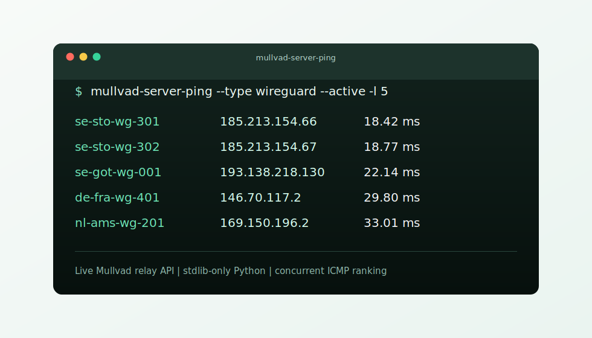

# Mullvad Server Ping

Minimal Python CLI for ranking Mullvad VPN relays by ICMP latency. It fetches the live relay list from Mullvad, filters the servers you care about, pings them concurrently, and prints the fastest results first.



## Why This Tool

* Uses Mullvad's live relay API.
* No third-party Python dependencies.
* Concurrent pinging for quick results.
* Local 24-hour API cache to avoid repeated relay-list downloads.
* Filters by country, active status, ownership, relay type, SOCKS support, and port speed.
* Warns when your default route appears to be a VPN tunnel, because that can make latency results misleading.

## Requirements

* Python 3.8+
* System `ping` command

## Installation

With Homebrew:

```sh
brew tap faeton/tap
brew install mullvad-server-ping
```

Run directly from the repository:

```sh
python ping_mullvad.py
```

Or install it as a local CLI:

```sh
python -m pip install .
mullvad-server-ping
```

No Python packages are installed beyond this project itself.

## Usage

```sh
mullvad-server-ping [-h] [-cc COUNTRY_CODE] [-cn COUNTRY_NAME]
                    [-a | --active | --no-active]
                    [-o | --owned | --no-owned]
                    [--socks] [-sp NETWORK_PORT_SPEED]
                    [-t THREADS] [-p | --progress | --no-progress]
                    [-v] [-l LIMIT] [--type SERVER_TYPE]
```

## Options

* `-cc, --country-code`: Filter by country code, such as `us`, `se`, or `de`.
* `-cn, --country-name`: Filter by exact country name, such as `Sweden`.
* `-a, --active` / `--no-active`: Include only active or inactive relays.
* `-o, --owned` / `--no-owned`: Include only Mullvad-owned or rented relays.
* `--socks`: Include only relays with SOCKS metadata, and print SOCKS endpoint details.
* `-sp, --network-port-speed`: Filter by network port speed in Gbit/s, such as `1` or `10`.
* `--type`: Filter by relay type, such as `wireguard`, `openvpn`, or `bridge`.
* `-t, --threads`: Concurrent ping count. Default: `100`.
* `-p, --progress` / `--no-progress`: Show or hide progress. Default: enabled.
* `-v, --verbose`: Print extra progress details to stderr.
* `-l, --limit`: Number of fastest results to print. Default: `10`; use `-1` for all.

## Examples

Rank the fastest reachable relays:

```sh
mullvad-server-ping
```

Show the five fastest active WireGuard relays in Sweden:

```sh
mullvad-server-ping --country-code se --type wireguard --active -l 5
```

Find fast 10 Gbit/s relays in Canada without the progress counter:

```sh
mullvad-server-ping --country-name Canada --network-port-speed 10 --no-progress -l 5
```

Show relays with SOCKS metadata:

```sh
mullvad-server-ping --socks --active -l 10
```

Example output:

```text
se-sto-wg-301        185.213.154.66  18.42 ms
se-sto-wg-302        185.213.154.67  18.77 ms
se-got-wg-001        193.138.218.130 22.14 ms
de-fra-wg-401        146.70.117.2    29.80 ms
nl-ams-wg-201        169.150.196.2   33.01 ms
```

## Cache

The relay list is cached in `api_cache.json` for 24 hours. The file is generated locally and ignored by Git.

## Data Source

Relay metadata comes from Mullvad's public endpoint:

```text
https://api.mullvad.net/www/relays/all/
```

## License

MIT
